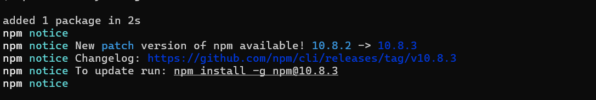
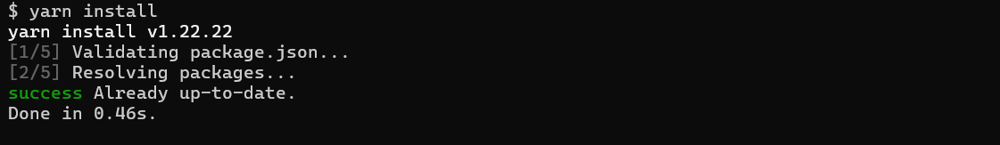
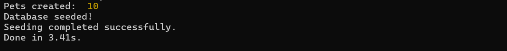
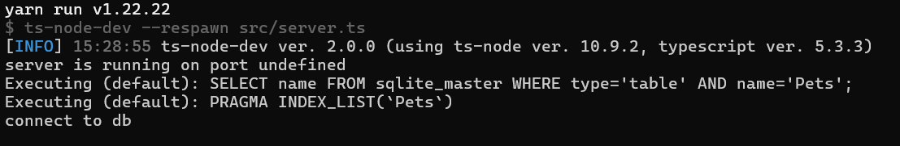
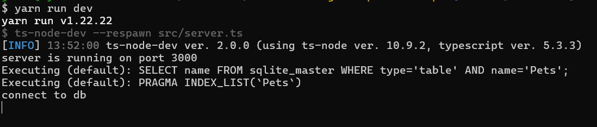

# Node challenge: Pet Adoption RESTful API

# 1. Overview

This repository is intended to be a quick template to help practice API concepts with NodeJS like HTTP requests, unit tests and API documentation.

A local animal shelter wants to create a website to facilitate pet adoption. The overall project seeks to create a platform that connects potential adopters with pets available for adoption.
The platform should allow admin users to view and manage pet profiles, review, and approve or reject open adoption requests. 
The public side of the API it should allow users to view pets available for adoption as well as submit adoption requests.

# 2. Environment Prerequisites

## Windows
1. Install NVM.
	[Windows](https://www.freecodecamp.org/news/node-version-manager-nvm-install-guide/)
2. Install Node JS wich must be a LTS version - example.
    ```
    nvm install lts
    ```
3. List the installed Node versions.
    ```
    nvm ls
    ```
4. Switch to the latest Node installed version - Must be >= 20.11.0 for this challenge.
    ```
    nvm use 20.11.0
    ```
5. Displays the current running version of NVM.
    ```
    nvm -v
    ```
6. Displays the current running version of Node.
    ```
    node -v
    ```

# 3. Build Instructions

1. Install yarn globally for dependency management.
    ```
    npm install yarn -g
    ```
    
2. Fork this repository and download it locally.
    [Github Docs](https://docs.github.com/en/pull-requests/collaborating-with-pull-requests/working-with-forks/fork-a-repo).
3. Go to the root directory of the repository and run this command to download the initial dependencies.
    ```
    yarn install
    ``` 
    
4. After installing the project you can run this command to configure the database.
    ```
    yarn run db:seed
    ``` 
    
5. Run the project
    First go to `src/config` folder and make a copy the env file and name it just `.env`, then you can run the server locally.

    ```
    yarn run dev
    ```
    
6. Run unit tests.
    ```
    yarn run test
    ```
    

# 4. Instructions

## 4.1 Functional Requirements
In this [link](./resources/images/functional_requirements.md) you will find the definition of all expected CRUD endpoints.

## 4.2 Business Rules

In this [link](./resources/images/business_rules.md) you will find the business rules for the app.

## 4.3 Technical Requirements
* Use TypeScript for server-side development.
* Implement Express.js to create the RESTful API.
* Use SQLite database to store pet and user data.
* Apply proper error handling and validation throughout the application.
* Include unit tests for critical features and components using Jest.

# 5. Testing and Validation Requisites
* The template includes base Unit tests, those must past unchanged
* In case you add extra util functions, those must also. Please add 
* The code coverage must be 100% and passing all in green
* In your submition, include screenshots of the tests passing locally

# 6. Acceptance Criteria

## 6.1 Evaluation criteria

* **Functionality:** Does the application meet the specified requirements?
* **Code quality:** Is the code well structured, readable, and meets best practices?
* **Tests:** Are there unit tests for critical components and do they all pass 100%?
* **Documentation:** Is the project well documented, used JSDoc comments to describe functions, and does it provide clear instructions for setup and use?
  
## 6.2 Expected documentation and deliverables
* Fork this repository from a personal Github account, work on your copy there
* Submit your link to your form to your tutor, including a clear SUBMISSION.md file that explains your project, specify the appropriate branch to evaluate and include clear instructions for API endpoints and data structures.
* Document any additional features or functionality implemented.
* All you functions must have JSDoc comments
* Include Postman collection file for easy review ([Export Postman collection](https://learning.postman.com/docs/getting-started/importing-and-exporting/exporting-data))


# 7. Resources

* Boilerplate repositories where this exercise was based
    * https://github.com/mwolfhoffman/node-jwt-sqlite-typescript-starter
    * https://github.com/Chensokheng/rest-api/tree/master
* [Intro to NodeJS](https://nodejs.org/en/learn/getting-started/introduction-to-nodejs) 
* [Ethereal Email](https://ethereal.email/): Fake SMTP service to simulate email sending.
    * [Using nodemailer with ethereal example](https://dev.to/berviantoleo/email-testing-using-ethereal-inb)
* [Official Typescript handbook](https://www.typescriptlang.org/docs/handbook/2/basic-types.html)

## Source of seed information used in this repo
* [Dog breeds](https://github.com/jfairbank/programming-elm.com/blob/master/dog-breeds.json)
* [Cat breeds](https://github.com/jfairbank/programming-elm.com/blob/master/cat-breeds.json)
